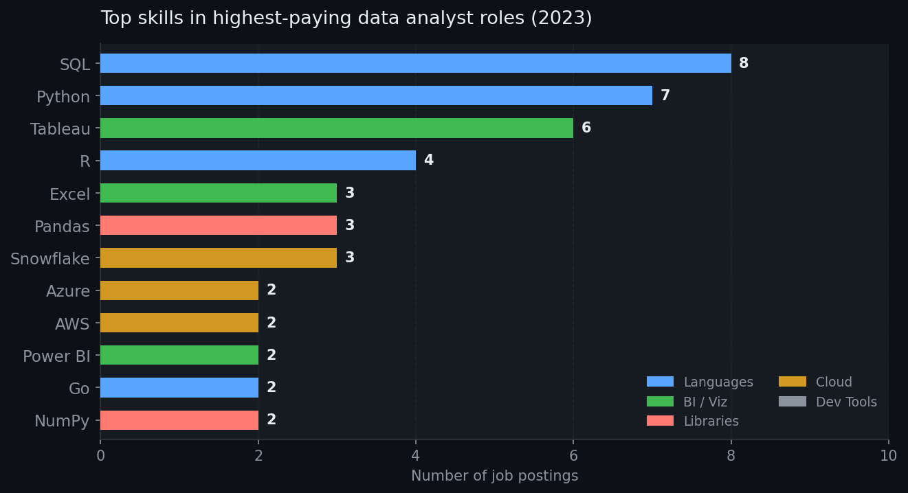
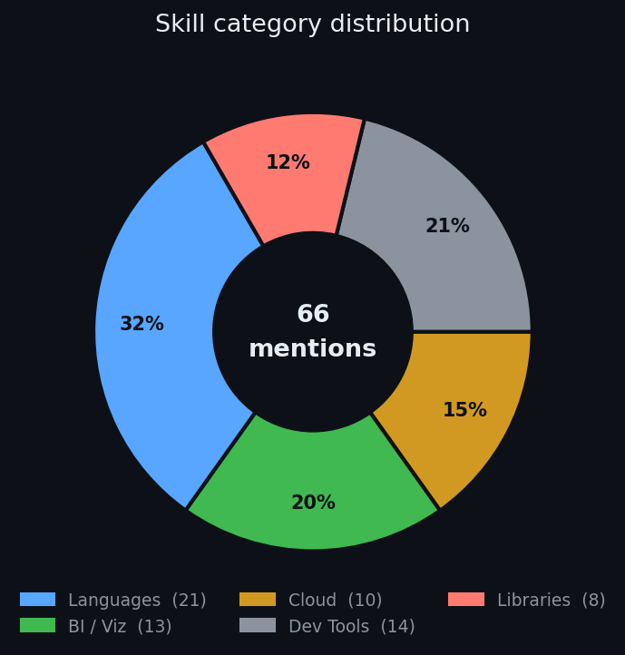
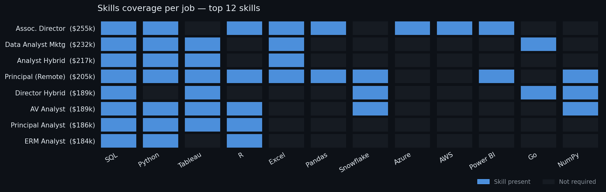

## Query 2 : top_paying_skills

Here's what stands out from the skills analysis:

**The core trio dominates.** SQL (8/8 jobs), Python (7/8), and Tableau (6/8) appear across almost every role — these are effectively non-negotiable for top-paying data analyst positions in 2023.

**Languages make up nearly a third of all skill mentions** (32%), reflecting how foundational programming and query skills are. Beyond SQL/Python, R shows up in 4 roles, particularly in senior/principal positions.

**BI & Visualization is the second-biggest category** — Tableau leads, but Power BI and Excel add to the picture. Even at high salary levels, spreadsheet skills (Excel) remain relevant.

**Cloud skills skew toward seniority.** Snowflake, Azure, and AWS mostly appear in the higher-paying roles (≥$205k), suggesting cloud platform fluency is a differentiator rather than a baseline expectation.

**Dev tools are surprisingly common** — Jira, Confluence, GitLab, and Atlassian cluster in a few roles, hinting that some senior analyst positions blur into data engineering or cross-functional tech team contexts.

**The ERM Analyst role ($184k) required only 3 skills** (SQL, Python, R), while the Director role ($189k) demanded 14 — salary doesn't always track with breadth of required skills.