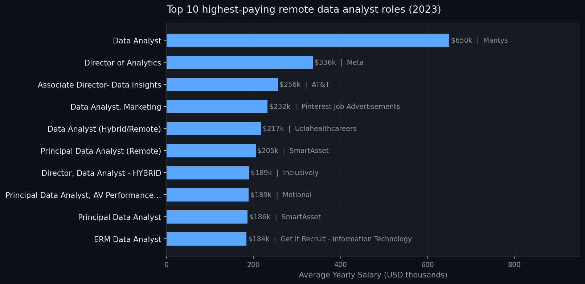
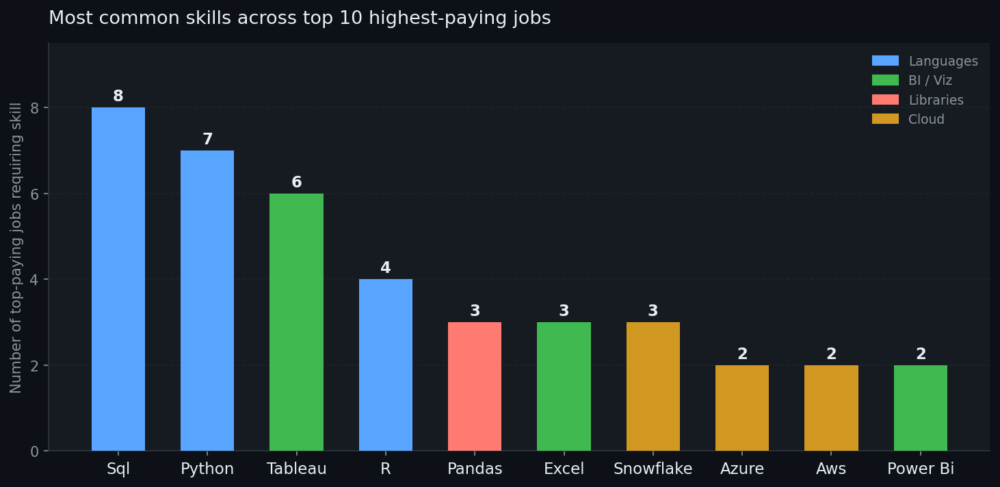
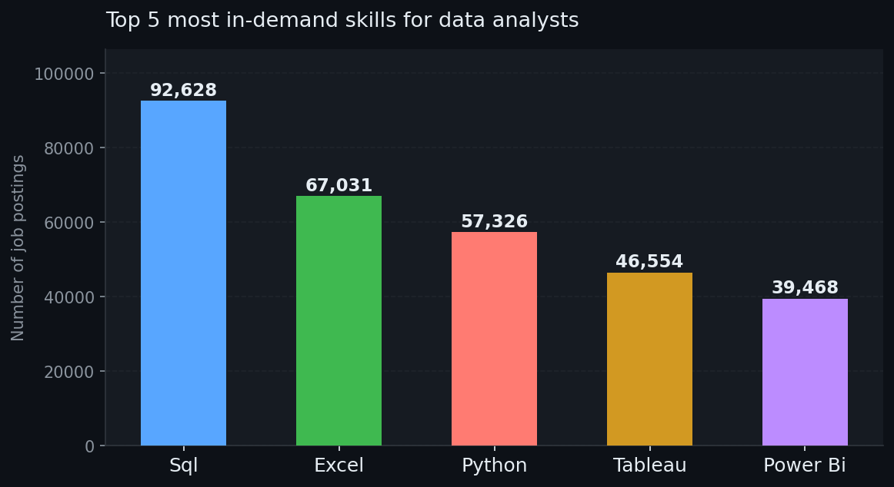
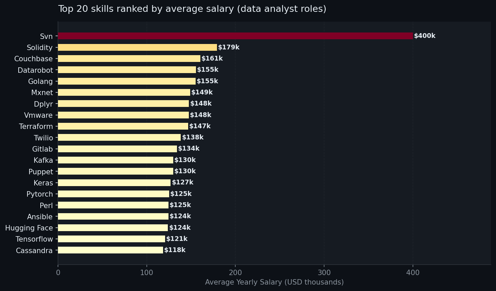
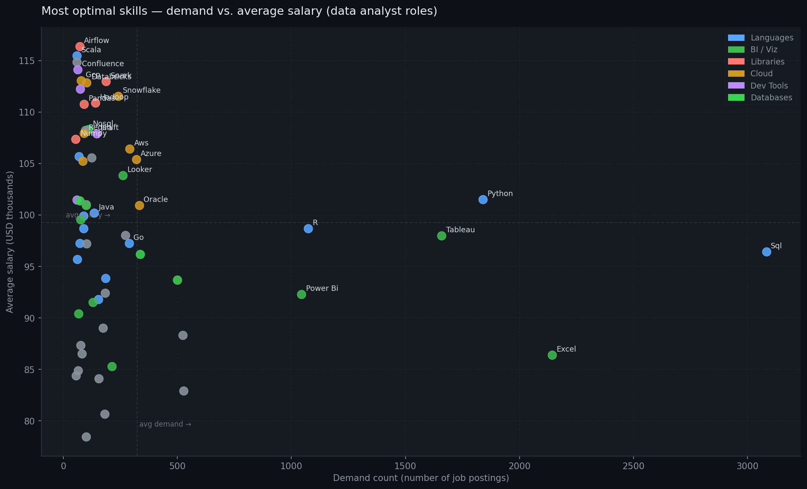

# 📊 Data Analyst Job Market Analysis (SQL)

An end-to-end SQL project exploring the 2023 data analyst job market — uncovering the highest-paying roles, the most in-demand skills, and where high demand meets high salary. Built to answer a practical question: **what should an aspiring data analyst actually learn?**

---

## 🧠 Background

The data analyst job market is crowded — but not all skills are created equal. This project uses a real-world dataset of 2023 job postings to answer five focused questions:

1. Which remote data analyst roles pay the most?
2. What skills do those top-paying jobs require?
3. What skills are most frequently demanded across all postings?
4. Which specific skills command the highest average salaries?
5. What is the **optimal** skill to learn — high demand *and* high pay?

The dataset spans hundreds of thousands of job postings, sourced from job boards globally, and includes salary data, skill requirements, company names, and posting dates.

---

## 🛠️ Tools Used

| Tool | Purpose |
|---|---|
| **PostgreSQL** | Core query engine for all analysis |
| **VS Code + SQLTools** | Query editor and database connection management |
| **Python (matplotlib)** | Generating visualizations from query results |
| **Git & GitHub** | Version control and project hosting |

---

## 🔍 The Analysis

Each query builds on the last, progressively narrowing from broad market trends to actionable skill recommendations.

---

### 1. Top Paying Remote Data Analyst Jobs

**Goal:** Identify the 10 highest-paying remote data analyst roles with non-null salaries.

**Approach:** Filtered `job_postings_fact` for remote data analyst roles, joined with `company_dim` to get company names, sorted by `salary_year_avg` descending.

```sql
SELECT  
    job_id,
    job_title,
    name AS company_name,
    salary_year_avg,
    job_posted_date
FROM
    job_postings_fact
LEFT JOIN company_dim ON company_dim.company_id = job_postings_fact.company_id
WHERE   
    job_title_short = 'Data Analyst' AND 
    job_location = 'Anywhere' AND
    salary_year_avg IS NOT NULL
ORDER BY salary_year_avg DESC
LIMIT 10;
```

**Results:**



**Key findings:**
- The top-paying role (Mantys, $650,000) is a significant outlier — nearly double the next highest salary.
- Meta's Director of Analytics at $336,500 represents the more realistic ceiling for senior individual contributor paths.
- SmartAsset appears twice in the top 10, signalling them as a high-compensation employer in this space.
- The salary range between rank 3 and rank 10 is relatively compressed ($184k–$256k), suggesting a competitive band for senior remote roles.

---

### 2. Skills Required by Top-Paying Jobs

**Goal:** Identify which skills are associated with those 10 highest-paying roles.

**Approach:** Used the top-paying jobs query as a subquery, then joined `skills_job_dim` and `skills_dim` to retrieve associated skills per job.

```sql
SELECT 
    top_10_jobs.*,
    skills_dim.skills
FROM (
     SELECT  
        job_id, job_title, name AS company_name, salary_year_avg       
    FROM job_postings_fact
    LEFT JOIN company_dim ON company_dim.company_id = job_postings_fact.company_id
    WHERE   
        job_title_short = 'Data Analyst' AND 
        job_location = 'Anywhere' AND
        salary_year_avg IS NOT NULL
    ORDER BY salary_year_avg DESC
    LIMIT 10
) AS top_10_jobs
LEFT JOIN skills_job_dim ON skills_job_dim.job_id = top_10_jobs.job_id
LEFT JOIN skills_dim ON skills_dim.skill_id = skills_job_dim.skill_id
WHERE skills_dim.skills IS NOT NULL
ORDER BY salary_year_avg DESC;
```

**Results:**



**Key findings:**
- **SQL** appears in 8 of the 10 top-paying roles — it is the single most universal requirement even at the highest salary levels.
- **Python** and **Tableau** follow closely, confirming the core analytics stack (query → script → visualize).
- Cloud tools (Azure, AWS, Snowflake, Databricks) cluster in the highest-paying individual roles, suggesting cloud fluency is a differentiator at the senior level.
- The highest-paying jobs tend to require **broader skill sets** — the $255k AT&T role listed 13 skills vs. the $184k ERM role requiring only 3.

---

### 3. Most In-Demand Skills (All Data Analyst Postings)

**Goal:** Find the top 5 most frequently requested skills across all data analyst job postings.

**Approach:** Inner-joined postings with skills tables, counted skill occurrences, and filtered to data analyst roles.

```sql
SELECT 
    skills,
    COUNT(skills_job_dim.job_id) AS demand_count
FROM job_postings_fact
INNER JOIN skills_job_dim ON skills_job_dim.job_id = job_postings_fact.job_id
INNER JOIN skills_dim ON skills_dim.skill_id = skills_job_dim.skill_id
WHERE job_title_short = 'Data Analyst' 
GROUP BY skills
ORDER BY demand_count DESC
LIMIT 5;
```

**Results:**



| Skill | Demand Count |
|---|---|
| SQL | 92,628 |
| Excel | 67,031 |
| Python | 57,326 |
| Tableau | 46,554 |
| Power BI | 39,468 |

**Key findings:**
- **SQL is in a class of its own** — demanded by nearly 93,000 postings, it's 38% more common than the second-place Excel.
- Excel's second-place finish is a reminder that despite advanced tools existing, spreadsheet fluency remains a baseline expectation across the industry.
- Python and Tableau together form the most complementary pair of "secondary" skills for anyone who already has SQL.
- Power BI's presence suggests Microsoft's BI ecosystem is highly relevant in corporate environments.

---

### 4. Skills Ranked by Average Salary

**Goal:** Find which skills are associated with the highest average salaries across all data analyst roles.

**Approach:** Averaged `salary_year_avg` grouped by skill, filtering for non-null salaries, top 20 results.

```sql
SELECT 
    skills,
    ROUND(AVG(salary_year_avg), 0) AS avg_salary
FROM job_postings_fact
INNER JOIN skills_job_dim ON skills_job_dim.job_id = job_postings_fact.job_id
INNER JOIN skills_dim ON skills_dim.skill_id = skills_job_dim.skill_id
WHERE 
    job_title_short = 'Data Analyst' AND
    salary_year_avg IS NOT NULL
GROUP BY skills
ORDER BY avg_salary DESC
LIMIT 20;
```

**Results:**



**Key findings:**
- **SVN ($400k)** and **Solidity ($179k)** top the salary list, but these are niche skills with very few job postings — the high salary reflects scarcity, not broad demand.
- **Big Data and ML tooling** (Kafka, PyTorch, TensorFlow, Keras) consistently cluster in the $120k–$130k range, suggesting that data analysts who can work adjacent to data engineering and ML command a significant premium.
- **DevOps-adjacent tools** like Terraform, Puppet, and Ansible appear mid-list — their presence suggests that infrastructure awareness is increasingly valued in analyst roles.
- The top-paying skills here largely **don't overlap** with the most in-demand skills, highlighting the trade-off explored in query 5.

---

### 5. Most Optimal Skills — High Demand + High Salary

**Goal:** Find the skills that are both highly demanded and highly paid, giving the best return on learning investment.

**Approach:** Two CTEs — one for demand count, one for average salary — joined on `skill_id`. Filtered with `HAVING COUNT > 50` for the salary-focused view to remove low-sample noise.

```sql
-- Salary-focused view (demand > 50 jobs)
SELECT 
    skills_dim.skill_id,
    skills_dim.skills,
    COUNT(skills_job_dim.job_id) AS demand_count,
    ROUND(AVG(salary_year_avg), 0) AS avg_salary
FROM job_postings_fact
INNER JOIN skills_job_dim ON skills_job_dim.job_id = job_postings_fact.job_id
INNER JOIN skills_dim ON skills_dim.skill_id = skills_job_dim.skill_id
WHERE 
    job_title_short = 'Data Analyst' AND
    salary_year_avg IS NOT NULL
GROUP BY skills_dim.skill_id
HAVING COUNT(skills_job_dim.job_id) > 50
ORDER BY avg_salary DESC, demand_count DESC;
```

**Results:**



*Dashed lines represent average demand and average salary across all skills shown.*

**Key findings:**
- Skills in the **upper-right quadrant** (above-average salary AND demand) represent the best investment: **Python, SQL, Tableau, R, Snowflake, AWS, Azure, and Spark** all land here.
- **SQL and Excel** dominate on demand but sit below the salary average — they're essential for getting hired but won't differentiate salary on their own.
- **Cloud platforms** (Snowflake, AWS, Azure, GCP, Databricks) are clustered in the high-salary zone with moderate-to-high demand — the clearest "upskill for pay" opportunity.
- **Airflow, Scala, and Spark** offer the highest salaries among skills with sufficient job postings (>50), signalling that data engineering adjacency is the path to the highest analyst compensation.

---

## 💡 What Was Learned

**Technical:**
- Writing multi-step queries using CTEs makes complex analyses far more readable and maintainable than deeply nested subqueries.
- The `HAVING` clause is essential when filtering on aggregates — `WHERE` runs before grouping and cannot filter on `COUNT()` or `AVG()` results.
- `LEFT JOIN` vs `INNER JOIN` matters: using an inner join on skills silently drops jobs with no listed skills, skewing demand counts.
- Handling `NULL` salaries early in the pipeline (via `WHERE salary_year_avg IS NOT NULL`) is cleaner than trying to exclude them at the aggregation stage.

**About the job market:**
- There's a meaningful difference between *what gets you hired* (SQL, Excel, Python) and *what gets you paid more* (cloud platforms, big data tools, ML libraries).
- The "optimal" skill set for a data analyst in 2023 is **SQL + Python as the floor**, with **Snowflake, AWS/Azure, or Spark** as high-value additions.
- Remote senior roles at tech/finance companies pay dramatically more than the median — targeting those employers specifically is a more effective salary strategy than accumulating more certifications.

---

## ✅ Conclusion

This project started with a simple question — *what should a data analyst learn?* — and the data gives a clear answer:

**Master SQL and Python first.** They're required everywhere and form the foundation. Then add **Tableau or Power BI** for visualization. After that, the highest ROI comes from **cloud platform skills** (Snowflake, AWS, Azure), which sit in the sweet spot of strong demand and above-average compensation. If you're aiming for the top salary bands, **Spark, Airflow, and Scala** signal engineering-adjacent analysts who can work at scale.

The analysis also revealed that the highest-paying jobs aren't just about technical skills — they tend to require broader stacks and appear at companies like Meta, AT&T, and SmartAsset that have mature data functions. Targeting those employers, while building toward the cloud + pipeline skillset, is the clearest path to a high-compensation data analyst career.

---

*Dataset sourced from [Luke Barousse's SQL Course](https://lukebarousse.com/sql). Analysis performed on PostgreSQL using VS Code + SQLTools.*